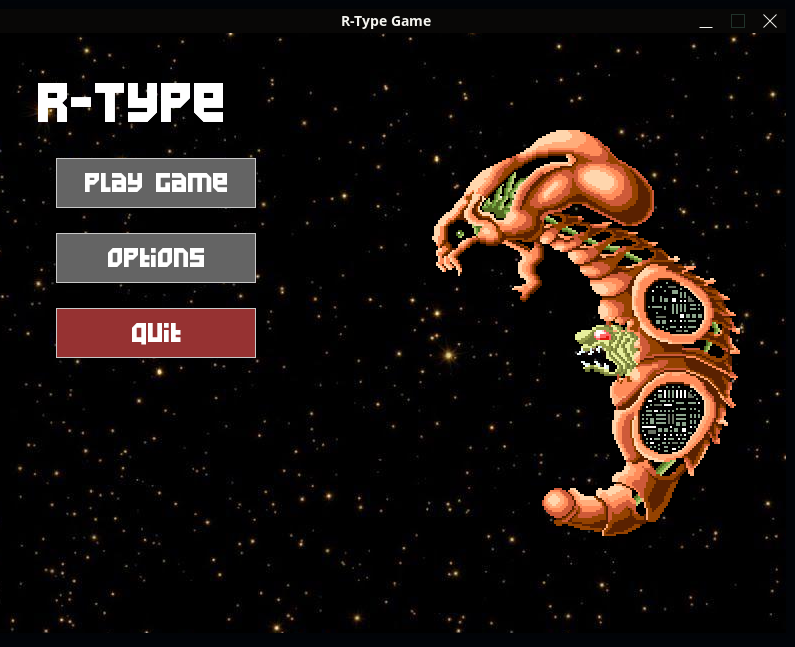
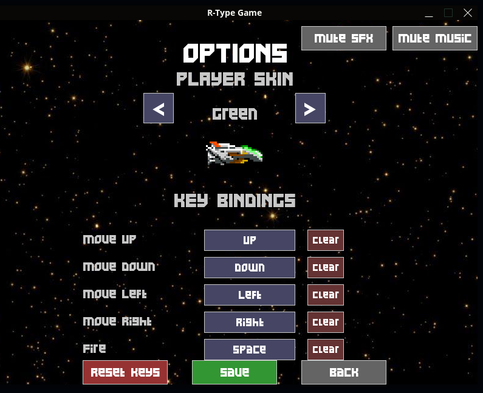
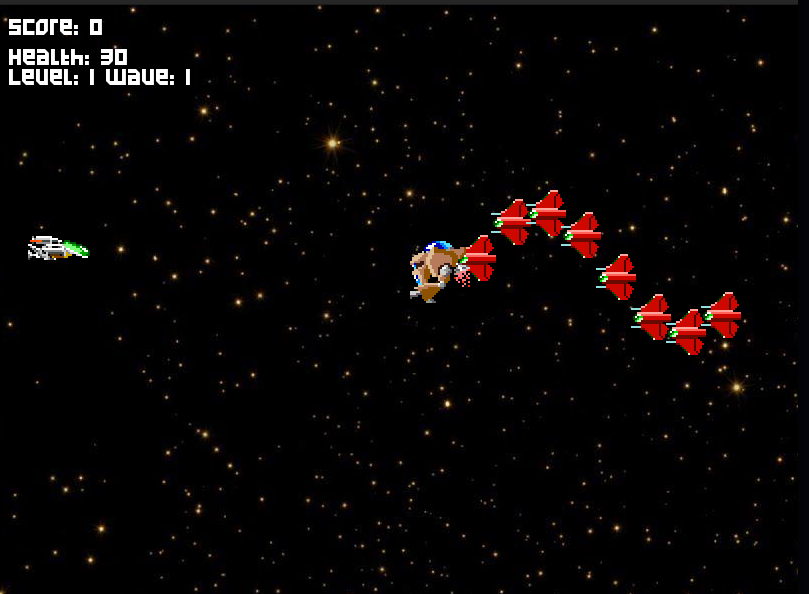

# **R-Type: A Networked Shoot'em Up Game Engine**

---

## **Table of Contents**
1. [Description](#description)
2. [Prerequisites](#prerequisites)
   - [System Requirements](#system-requirements)
   - [Dependencies Setup](#dependencies-setup)
3. [Build Instructions](#build-instructions)
4. [Usage Instructions](#usage-instructions)
   - [Keyboard Controls (Client)](#keyboard-controls-client)
   - [Gameplay](#gameplay)
5. [Accessibility Features](#accessibility-features)
6. [Authors](#authors)
7. [Technical Documentation](#technical-documentation)
   - [Core Documentation](#core-documentation)
   - [Network Documentation](#network-documentation)
   - [Quick Link](#quick-link)

---

## **Description**
**R-Type** is a **multiplayer networked horizontal shoot'em up** game, inspired by the 1990s classic. This project implements a **modular game engine**, a **multithreaded server**, and a **graphical client**, with a focus on real-time network synchronization and reusable architecture.

**Key Features**:
- **Custom game engine** (ECS architecture, decoupled systems).
- **Binary network protocol** (UDP and TCP, optimized for real-time gameplay).
- **Game design tools** for easy content creation.

---

## **Prerequisites**
### **System Requirements**
- **OS**: Linux, Windows 10.
- **Compiler**: GCC 14+.
- **Tools**: CMake 3.30+, Git, CPM package manager.

### **Dependencies Setup**
Automatically managed via CPM – see differents setup
- [Client setup CMakeLists.txt](CMakeLists.txt)
- [Server GameLogic setup CMakeLists.txt](Server/CMakeLists.txt)
- [Server Network setup CMakeLists.txt](Server/src/CMakeLists.txt)

The installation manager only installs the following packages:
- **Graphique**: SDL2, SDL2_ttf, SDL2_mixer, SDL2_image
- **Network**: asio

Please make sure you have the Prerequisites
---

## **Build Instructions**
### **1. Clone the Repository**
```bash
git clone https://github.com/jeremyarmijo/R-Type.git
cd R-Type
```

**2. Install Dependencies**:
```bash
# Make sure you are in the root of R-Type project
mkdir -p cmake
wget -O cmake/CPM.cmake https://github.com/cpm-cmake/CPM.cmake/releases/latest/download/get_cpm.cmake
cd Server
mkdir -p cmake
wget -O cmake/CPM.cmake https://github.com/cpm-cmake/CPM.cmake/releases/latest/download/get_cpm.cmake
cd src
mkdir -p cmake
wget -O cmake/CPM.cmake https://github.com/cpm-cmake/CPM.cmake/releases/latest/download/get_cpm.cmake
```

### **3. Configure with CMake**
```bash
mkdir build && cd build
cmake ..
```

### **4. Build the Project**
```bash
make
```

### **5. Run the Game**
#### **Server**
```bash
./r-type_server [PORT] [HOST]
# Example:
./r-type_server 4242 192.x.x.x
```

#### **Client**
```bash
./r-type_client
# Example:
./r-type_client
```

---

## **Usage Instructions**
### **Keyboard Controls (Client)**
| Key          | Action                     |
|---------------|----------------------------|
| **↑/↓/←/→**  | Move spaceship             |
| **Space**     | Fire                       |
| **Esc**       | Quit                       |

### **Gameplay**
- **Objective**: Destroy enemies (Bydos) and survive waves.
- **Elements**:
  - **Starfield**: Scrolling background.
  - **Spaceship**: Up to 4 players max, in distinct colors.
  - **Enemies**: Random spawn on the right, varied movement patterns.


<p align="center">
   
   
   
</p>

---

## **Accessibility Features**

R-Type includes several accessibility and customization options to enhance your gaming experience:

### **Controls & Input**
- **Customizable Key Bindings**: Remap all game controls to your preference
  - Movement keys (Up/Down/Left/Right)
  - Fire button
  - Easy-to-use rebinding interface in the Options menu
- **Default Controls**: Pre-configured for immediate gameplay

### **Game Difficulty**
- **5 Difficulty Levels**: Choose from 1 (Easy) to 5 (Expert)
- **Adjustable Challenge**: Set difficulty when creating a lobby
- **Adaptive Gameplay**: Difficulty affects enemy waves and spawn patterns

### **Multiplayer Options**
- **Solo Play**: Play alone against AI enemies
- **Multiplayer**: Support for 1-4 players
- **Flexible Lobby**: Choose maximum number of players (1-4) when creating a game
- **Private/Public Lobbies**: Create password-protected or open game sessions

### **Visual Customization**
- **Player Skins**: Multiple spaceship color schemes available
  - Blue (default)
  - Red
  - Green
  - Yellow
  - And more variants
- **Skin Preview**: View your selected skin before playing
- **Easy Selection**: Navigate skins with simple arrows in Options

### **Audio Controls**
- **Independent Volume Control**:
  - Music volume adjustment (0-128)
  - Sound effects volume adjustment (0-128)
- **Mute Options**:
  - Toggle music on/off
  - Toggle sound effects on/off
  - Quick access mute buttons in Options menu
- **Audio Persistence**: Settings saved between game sessions

### **User Interface**
- **Settings Menu**: Centralized options interface
- **Save/Load Settings**: Automatically persist your preferences
- **Reset to Defaults**: Quick restore of default key bindings
- **Visual Feedback**: Button states and selected options clearly indicated


---

## **Authors**
- **Team**:
  - [Jeremy Armijo](jeremy.armijo@epitech.eu)
  - [Dalia Guiz](dalia.guiz@epitech.eu)
  - [Jason Zohou](jason.zohou@epitech.eu)
  - [Xavier Daste](xavier.daste@epitech.eu)
  - [Ziad Bengherabi](ziad.bengherabi@epitech.eu)

---

## **Technical Documentation**

### **Core Documentation**
- **[Doxygen](https://jeremyarmijo.github.io/R-Type/)** - Detailed class and method documentation
- **[Contributing Guide](documentation/CONTRIBUTING.md)** - How to contribute to the project conventional contribution
- **[Server Technical Documentation](documentation/SERVER_TECHNICAL_DOC.md)** - Complete server architecture, networking.
- **[Gameplay Guide](documentation/HowToContribute.md)** - Detailed programming proccess for GamePlay contribution
- **[Network client](documentation/NetworkClient.md)** - Detailed programming proccess for network part for client contribution 

### **Network Documentation**
- **[Network Protocol](documentation/network/protocoleRFC.txt)** - Client-server communication protocol

### **Quick Link**
- [Full class Documentation](https://jeremyarmijo.github.io/R-Type/)
